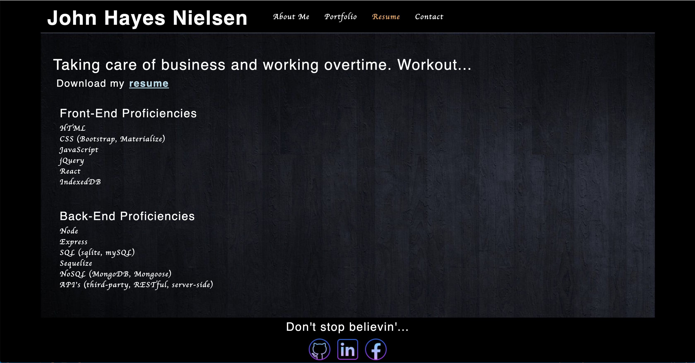
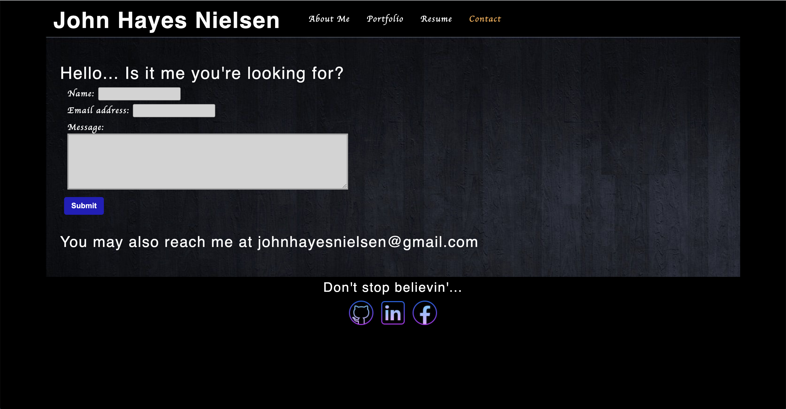

This project was bootstrapped with [Create React App](https://github.com/facebook/create-react-app).

# In Memoriam 
>A react program that allows users to view my work and contact me.

## Table of contents
* [General info](#general-info)
* [Installation](#installation)
* [Functionality](#functionality)
* [Screenshots](#screenshots)
* [Status](#status)
* [Links](#links)
* [License](#license)
* [Contact](#contact)

## General info
This app gives users the oportunity to read a litt about me, view my work through deeployed applications and my Github Repo, look at my resume, and contact me with any questions they may have.

## Installation
Steps required to install project:

- Clone the repo to your own system.
- Run npm install from the command line in the root directory
- Invoke the application with "npm start"

You may also just view the working deployment at the link in the Links section.

## Functionality
Currently this is a front-end only application with very basic functionality. You will begin on the About Me page, where you can read about me and view my profile picture. You can then click on the different options in the Navbar: Portfolio, Resume, and Contact. In the Portfolio, you can view screenshots of some projects I have done, and then click on the links to either visit the Github Repo or view the deployed application. In the Resume section, you can view some listed proficiencies, and also download a PDF of my resume. In the Contact section, you will EVENTUALLY be able to use the form to send me an email. (This is currently only a front-end app, though, so it doesn't work.) You can also view my email and use that to get in touch with me.

## Screenshots

## Status
Project is: _complete_ (for now)

## Links
Respository Link - https://github.com/JohnNielsen1221/react-portfolio/

Deployed on Github Pages - https://johnnielsen1221.github.io/react-portfolio/

## License
Permission is hereby granted, free of charge, to any person obtaining a copy of this software and associated documentation files (the "Software"), to deal in the Software without restriction, including without limitation the rights to use, copy, modify, merge, publish, distribute, sublicense, and/or sell copies of the Software, and to permit persons to whom the Software is furnished to do so, subject to the following conditions:

The above copyright notice and this permission notice shall be included in all copies or substantial portions of the Software.

THE SOFTWARE IS PROVIDED "AS IS", WITHOUT WARRANTY OF ANY KIND, EXPRESS OR IMPLIED, INCLUDING BUT NOT LIMITED TO THE WARRANTIES OF MERCHANTABILITY, FITNESS FOR A PARTICULAR PURPOSE AND NONINFRINGEMENT. IN NO EVENT SHALL THE AUTHORS OR COPYRIGHT HOLDERS BE LIABLE FOR ANY CLAIM, DAMAGES OR OTHER LIABILITY, WHETHER IN AN ACTION OF CONTRACT, TORT OR OTHERWISE, ARISING FROM, OUT OF OR IN CONNECTION WITH THE SOFTWARE OR THE USE OR OTHER DEALINGS IN THE SOFTWARE.

## Contact

Created by John Hayes Nielsen - johnhayesnielsen@gmail.com